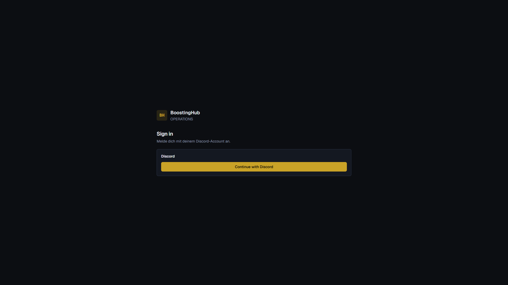
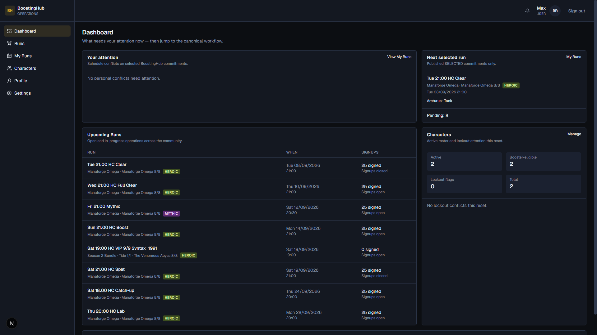
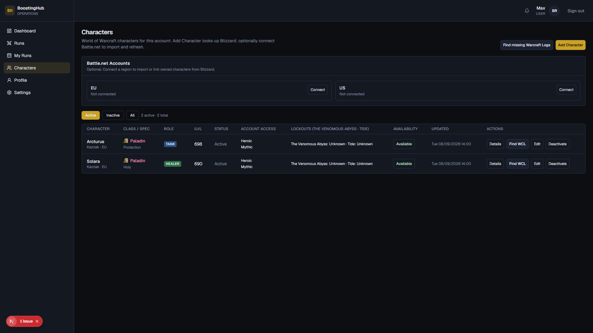
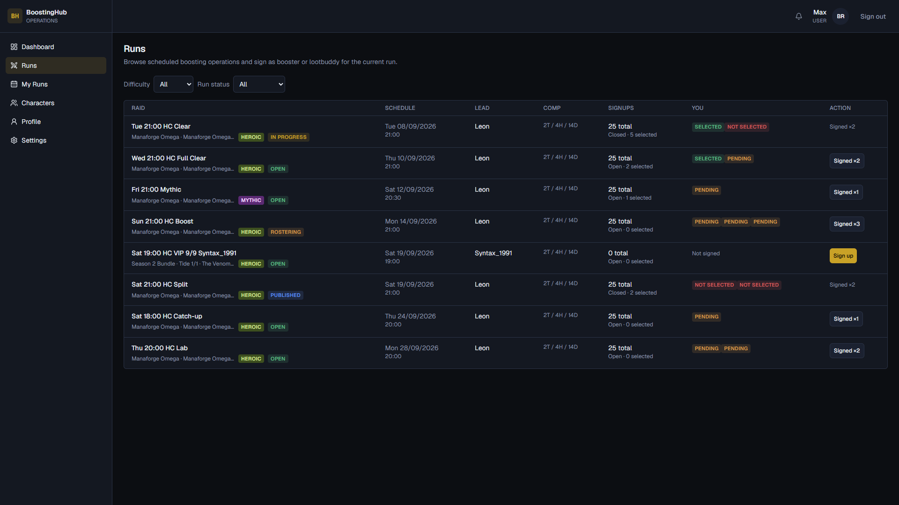
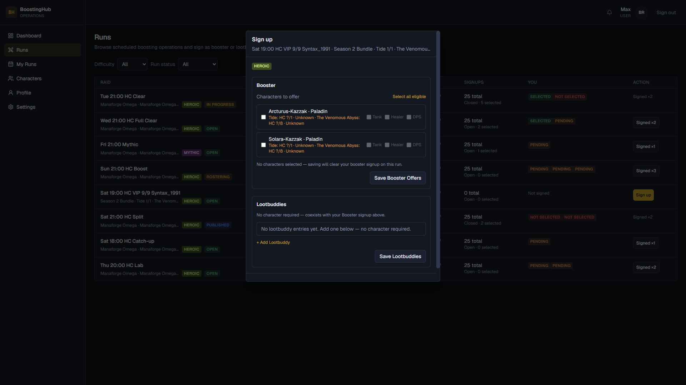
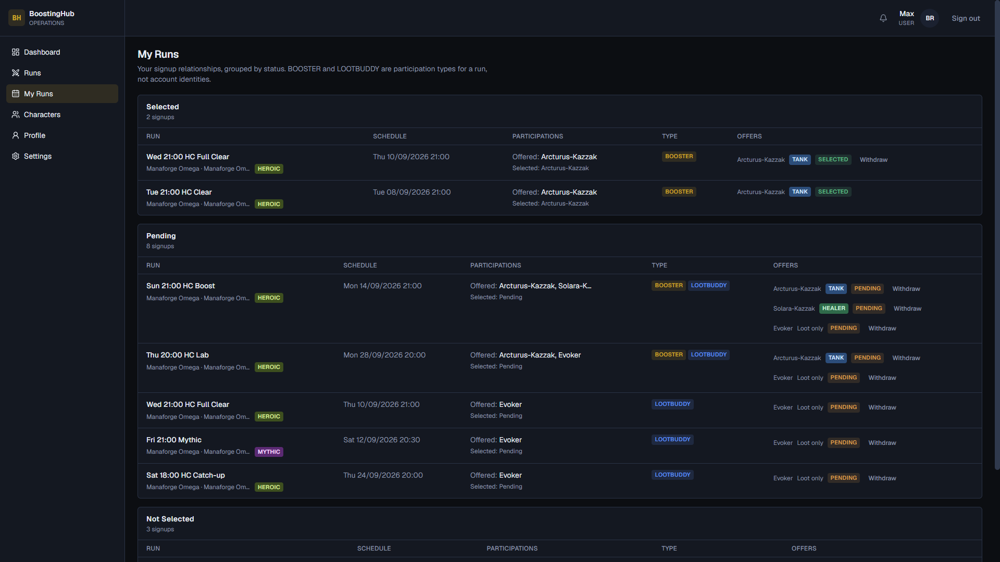

# Anleitung für Booster

Kurzer Einstieg in BoostingHub: anmelden, Characters anlegen, für Runs anmelden und den Status unter **My Runs** verfolgen.

> **Wichtig:** Dein Account-Rolle ist meist **USER**. **BOOSTER** und **LOOTBUDDY** sind keine Account-Rollen, sondern **Teilnahmearten pro Run**.

---

## 1. Anmelden

Öffne BoostingHub und melde dich mit **Continue with Discord** an. Discord ist der Produktions-Login.



Nach dem Login landest du auf dem **Dashboard**.

---

## 2. Dashboard

Hier siehst du auf einen Blick:

- **Your attention** — Termin-Konflikte bei ausgewählten Runs
- **Upcoming Runs** — offene und laufende Community-Runs
- **Next selected run** — dein nächster **SELECTED**-Run inkl. Character und Rolle
- **Characters** — aktive / booster-eligible Characters und Lockout-Hinweise



---

## 3. Characters anlegen

Unter **Characters** verwaltest du deine WoW-Chars. Für Booster-Signups brauchst du mindestens einen **aktiven** Character.

1. Optional **Battle.net** (EU/US) verbinden — Import und Item-Level-Refresh.
2. Oder **Add Character**: Region / Realm / Name eingeben, Spec wählen (Klasse und ilvl kommen von Blizzard).
3. Prüfe **Account Access** (z. B. Heroic / Mythic) und **Availability**.



### Booster-Zugang (Qualification)

Um dich als **Booster** für eine Difficulty anzumelden, brauchst du eine freigeschaltete **Booster Qualification** (User + Difficulty, z. B. Heroic). Die beantragst du über Discord (**Apply via Discord**) — nicht über ein Self-Service-Formular in der App. Ohne Freigabe kannst du dich weiterhin als **Lootbuddy** anmelden.

---

## 4. Für einen Run anmelden

Öffne **Runs**. Filtere nach Difficulty oder Status und suche Runs mit **Signups open**.



Spalten kurz erklärt:

| Spalte | Bedeutung |
| --- | --- |
| **RAID** | Titel, Content, Difficulty, Status |
| **SCHEDULE** | Datum / Uhrzeit |
| **LEAD** | zuständiger Raid Lead |
| **COMP** | Ziel-Composition (z. B. 2T / 4H / 14D) |
| **YOU** | dein Status (Not signed, Pending, Selected, …) |
| **ACTION** | **Sign up** oder bereits **Signed ×N** |

Klicke **Sign up**. Im Dialog gibt es zwei unabhängige Bereiche:

### Booster

1. Character(s) anhaken.
2. Angebotene Rollen wählen (**Tank** / **Healer** / **DPS**) — was deine Klasse kann.
3. **Save Booster Offers**.

### Lootbuddy

- Kein Character nötig.
- Class + Mode (**Loot only** oder **Play along**).
- Kann parallel zum Booster-Signup bestehen.
- **Save Lootbuddies**.



Web und Discord nutzen **dieselben** Signups — siehe Abschnitt 5.

---

## 5. Anmeldung über den Discord-Bot

Voraussetzung: Discord-Account ist mit BoostingHub verknüpft (einmalig über Discord-Login auf der Website).

Jeder offene Run hat einen eigenen Discord-Channel mit **Signup-Embed** und Buttons:

| Button | Wirkung |
| --- | --- |
| **Signup** | Als Booster anmelden (Character + Rollen) |
| **Sign as Lootbuddy** | Als Lootbuddy anmelden (Klassen wählen) |
| **Cancel Signup** | Aktive Booster- **und** Lootbuddy-Teilnahme zurückziehen |

### Booster (Button Signup)

1. Im Run-Channel **Signup** klicken (Antwort ist nur für dich sichtbar).
2. Character(s) auswählen → **Next**.
3. Pro Character angebotene Rollen setzen → **Confirm**.

Ohne freigeschaltete Booster-Qualification oder ohne eligible Characters bricht der Flow mit einer Meldung ab.

### Lootbuddy (Button Sign as Lootbuddy)

1. **Sign as Lootbuddy** klicken.
2. Eine oder mehrere Klassen wählen → bestätigen.
3. Discord speichert das als **Loot only** (ein Eintrag pro Klasse). Mode **Play along** und feinere Lootbuddy-Sets nur über die Website.

### Cancel Signup

Zieht **Booster und Lootbuddy** auf diesem Run zurück (anders als Web „Cancel Booster“, das nur Booster betrifft). Geschützte Roster-/Selected-Zeilen können die Aktion blocken.

### Slash-Command `/mysignups`

Zeigt deine aktuellen Signups (ephemeral), gruppiert wie **My Runs** auf der Website. Es gibt kein `/signup` — Anmeldung läuft nur über die Embed-Buttons.

Nach Publish erscheint im selben Channel das **Roster-Embed** (nur Selected). Beim **Start Run** kann zusätzlich eine Raid-Invite-DM kommen (wenn in Settings erlaubt).

---

## 6. Status unter My Runs

Unter **My Runs** siehst du deine Signups gruppiert:

- **Selected** — im veröffentlichten Roster
- **Pending** — Angebot, Raid Lead entscheidet noch
- **Not Selected** / **Withdrawn** — Historie



**Withdraw** zieht ein Angebot zurück, solange die Regeln es erlauben (z. B. Pending meist frei; Selected oft erst vor Publish / Start).

---

## 7. Ablauf eines Runs (aus Booster-Sicht)

```text
Sign up (Pending)
  → Raid Lead baut Roster
  → Publish (Selected / Not Selected)
  → Start Run
  → Attendance
  → Complete → Payout
```

Auf dem Dashboard und unter **My Runs** erkennst du, ob du Selected bist und mit welchem Character / welcher Rolle.

---

## Kurz-Checkliste

1. Discord-Login (verknüpft Discord mit BoostingHub)
2. Character(s) unter **Characters** anlegen
3. Booster-Zugang für die Difficulty über Discord beantragen (**Apply via Discord**)
4. Anmelden: Website **Runs → Sign up** *oder* Discord-Buttons im Run-Channel
5. Status prüfen: **My Runs** / `/mysignups`, bei Bedarf Withdraw / **Cancel Signup**
