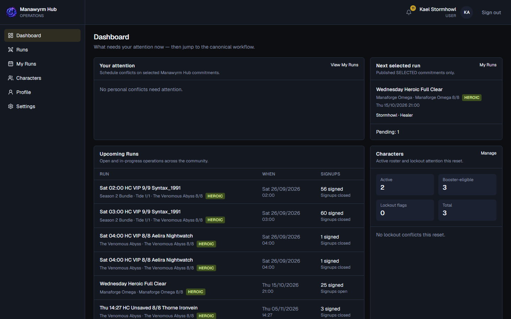
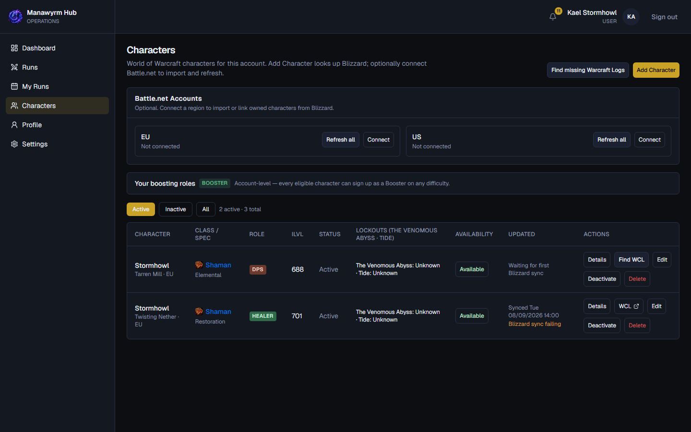
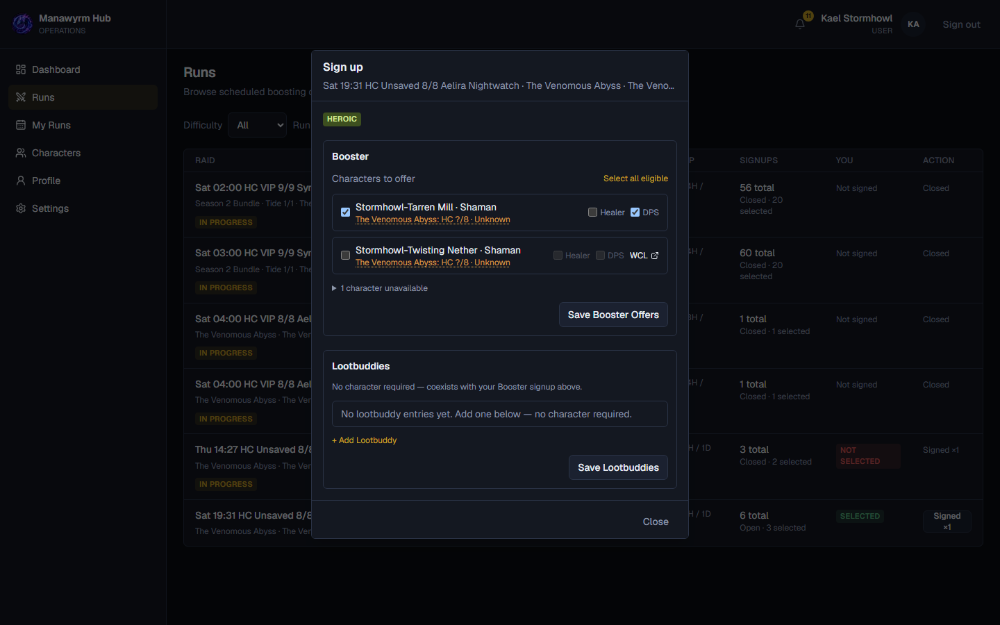
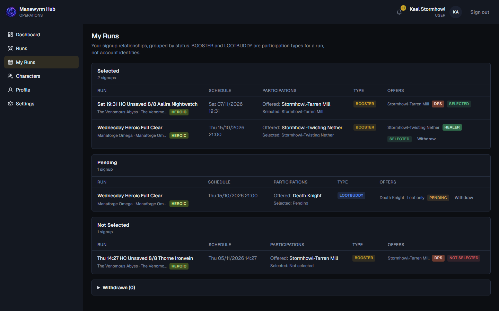

# Anleitung für Booster

Kurzer Einstieg in **Manawyrm Hub**: anmelden, Characters verwalten, für Runs anmelden und den Status unter **My Runs** verfolgen.

> **Booster** ist eine Boosting-Rolle, die Community/Admin vergibt. Sie gilt für den **Account**, nicht für einen einzelnen Character. Pro Run wählst du weiterhin, wie du teilnimmst (Booster und/oder Lootbuddy).

App: https://manawyrm-boosting.com

---

## 1. Einstieg

Melde dich mit **Discord** an. Du landest auf dem **Dashboard** mit Shortcuts zu **Runs**, **Characters** und **My Runs**.



---

## 2. Characters

Unter **Characters**:

1. Optional **Battle.net** verbinden oder **Add Character** nutzen.
2. Die **Specialization** liefert die Default-Rolle für Discord Quick Signup.
3. **Availability** setzen.
4. Lockouts sind **nur informativ**.
5. Inaktive oder wöchentlich nicht verfügbare Characters werden bei Quick Signup **übersprungen**. Gespeicherte Characters und Characters auf nicht-kollidierenden anderen Runs werden **eingeschlossen**.

Die Booster-Rolle gilt **account-weit**.



---

## 3. Anmeldung (Website)

**Runs** → **Sign up**.

Manueller Booster-Flow:

1. Einen oder mehrere Characters auswählen
2. Angebotene Rollen wählen (Tank / Healer / DPS)
3. **Save Booster Offers**

Die Website eignet sich am besten für feine Rollenwahl. Es gibt **keinen** Web-Quick-Signup-Button.

**Lootbuddy**-Einträge sind unabhängig und können parallel zu Booster-Offers bestehen.



---

## 4. Discord-Signups

Jeder offene Run-Channel hat eine persistente **Signups**-Nachricht mit vier Buttons:

| Button | Wirkung |
| --- | --- |
| **Signup** | Characters und angebotene Rollen manuell wählen |
| **Quick Signup** | Ein Klick: Offers für alle geeigneten Booster-Characters mit Spec-Default-Rolle. Gespeicherte Characters und nicht-kollidierende andere Runs werden eingeschlossen; weekly unavailable, kollidierende Reservation (&lt; 2h), inaktiv und fehlende Default-Rolle werden übersprungen. Additiv; bestehende Offers bleiben. Füllt das **Roster nicht automatisch** — der Raid Lead wählt separat. |
| **Sign as Lootbuddy** | Erstellt **Loot-only**-Einträge (Play along und feinere Sets nur auf der Website) |
| **Cancel Signup** | Zieht Booster- **und** Lootbuddy-Teilnahme für diesen Run zurück |

Für manuelle Rollenkontrolle **Signup** nutzen.

Schneller Status: `/mysignups`.

---

## 5. Nach der Anmeldung

Unter **My Runs**:

- **Pending** — du hast dich angeboten
- **Selected** — du stehst im veröffentlichten Roster
- **Not Selected / Withdrawn** — Historie / aktueller Stand

Ablauf:

```text
Signup → Roster → Publish → Start → Attendance → Complete → Payout
```



### Checkliste

1. Mit Discord anmelden
2. Character(s) anlegen + Booster-Rolle
3. Anmelden (Website oder Discord)
4. Status prüfen: **My Runs** / `/mysignups`
