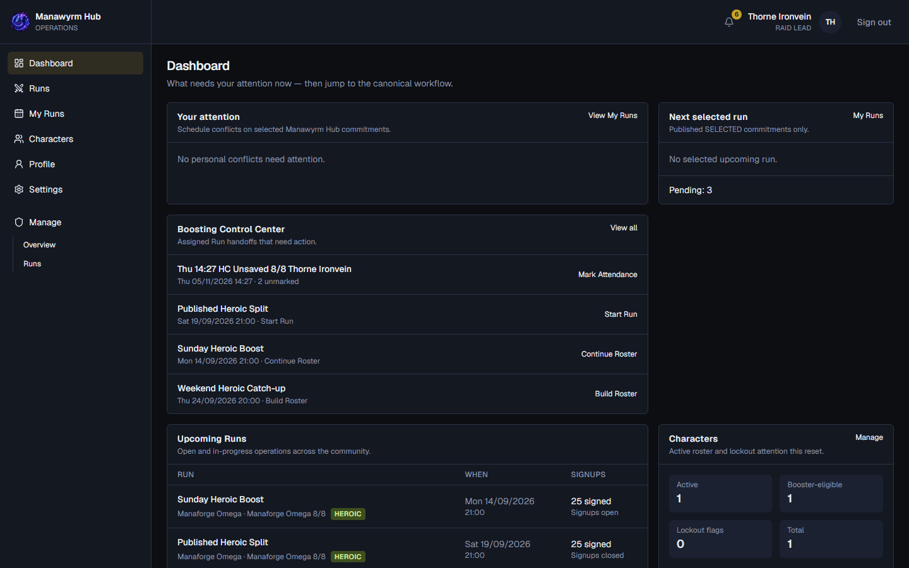
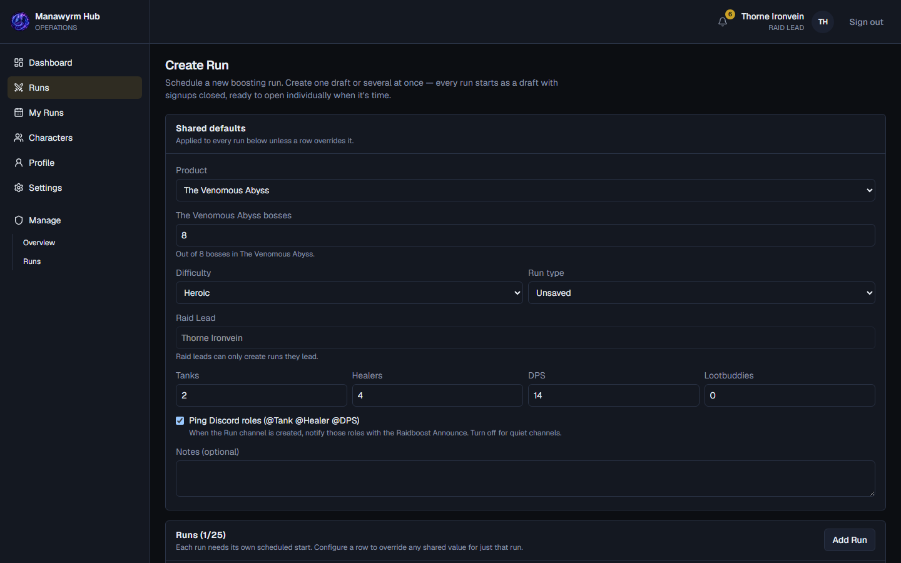
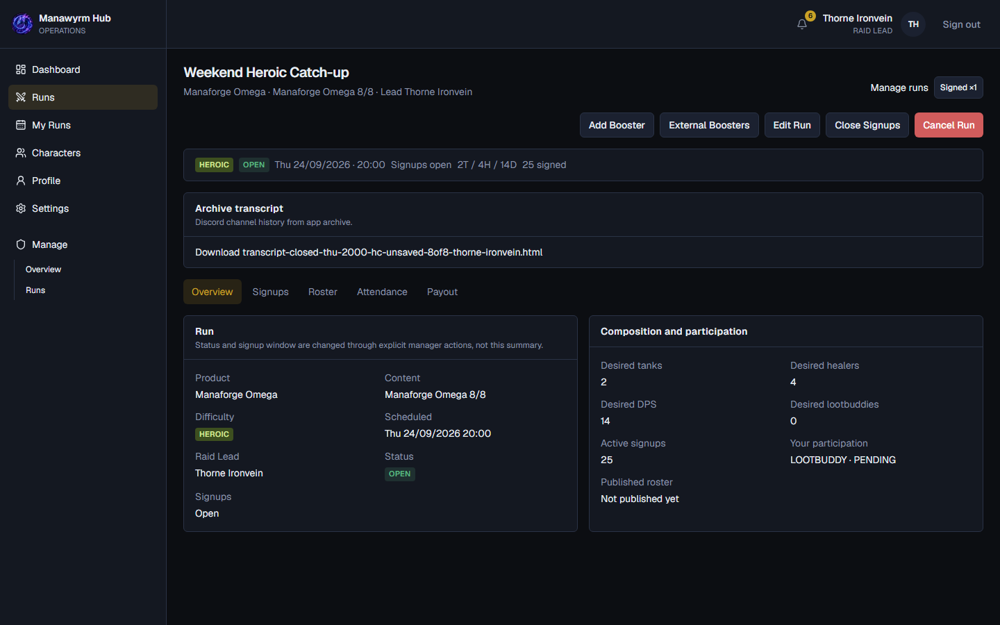
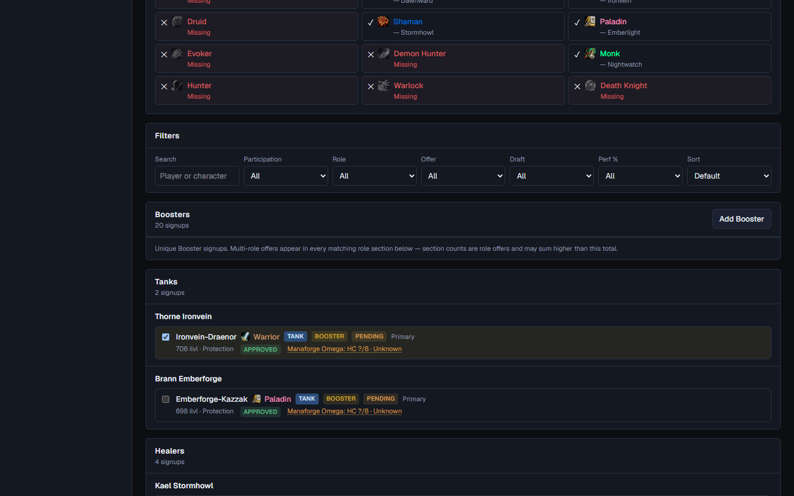
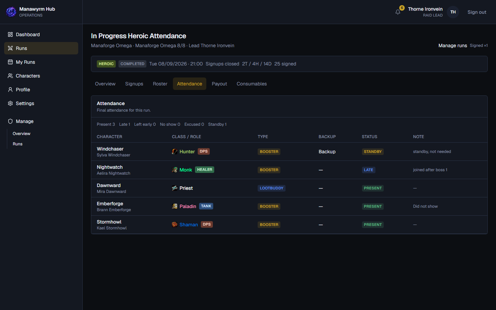
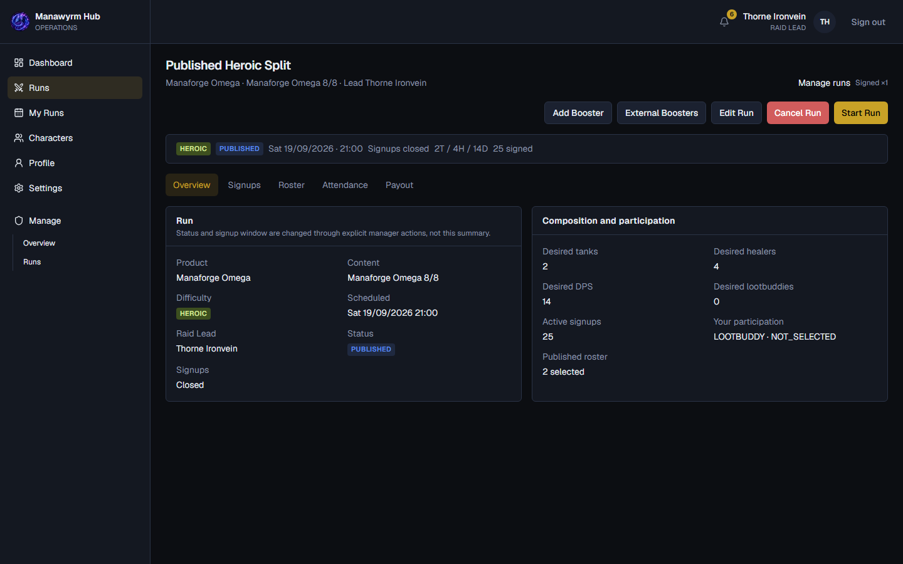

# Raid Lead Guide — Discord preview (v2)

Review-only. **Do not publish** from this file. Live upsert uses:

```bash
npm run guide:raidlead:preview
npm run guide:raidlead:publish
npm run guide:raidlead:publish -- --retire-legacy
```

Channel: `GUIDE_CHANNEL_IDS.raidlead` → `1553768153572708514`

Accent: gold `0xd4af37` (same as Booster Guide). Footer identity:

`Manawyrm Hub · guide:raidlead:v2:<cardKey> · asset:<sha12>`

---

## Card 1 — `raid-lead-basics`

**Title:** 📗 Manawyrm Hub — Raid Lead Guide

Sign in with **Discord**. As a **RAID_LEAD** you see **Manage** and work your assigned Runs.

- You manage Runs where **you** are the Raid Lead.
- **ADMIN** can manage every Run.
- Use the **Dashboard** for Build Roster / Start / Attendance hand-offs.

CTA: Open Manawyrm Hub



---

## Card 2 — `create-run`

**Title:** 🛠️ Create a Run

**Runs → Create Run** (1–25 drafts in one submit).

**Shared defaults**

- **Product** — The Venomous Abyss, or Season 2 Bundle
- **Bosses** — planned Venomous coverage (1–8)
- **Difficulty** — Normal / Heroic / Mythic
- **Run type** — Saved / Unsaved / VIP / **Community**
- **Composition** — Tanks / Healers / DPS / Lootbuddy target
- Optional Discord role ping + notes

Set a **start time** per row, then **Create N Draft(s)**. Title is generated automatically.

Mythic cannot use Saved. As Raid Lead, the lead is always you.



---

## Card 3 — `open-manage-signups`

**Title:** 📣 Open & Manage Signups

On **Overview**:

- **Open Run** — Draft → Open, signups open
- **Close / Reopen Signups** — window only
- **Edit Run** — allowed until **Start**
- **Cancel Run** — history kept; not available after Start

Discord keeps a persistent **Signups** message and a persistent **Roster** message.



---

## Card 4 — `build-roster`

**Title:** 👥 Build the Roster

**Signup ≠ Selected.** Offers arrive first; you choose the lineup.

1. Review Booster offers + Lootbuddies
2. Select Character / **Selected Role**
3. Add registered Boosters or **External Boosters** when needed
4. Check composition, class buffs, schedule conflicts, same-reset commitments
5. **Save Roster**
6. **Publish Roster** → SELECTED / NOT_SELECTED and status **Published**



---

## Card 5 — `run-attendance`

**Title:** ▶️ Run & Attendance

**Start Run** (Published + published roster + ≥1 SELECTED):

- Status → **In Progress**
- Signups close
- Attendance snapshot of SELECTED players
- Raid Invite DMs + Discord Final Setup / Voice

**Attendance:** Present / Late / No show / Standby / Excused · **Mark all unmarked as Present** · **Complete** requires no Unmarked rows.



Supporting Start Run view:



---

## Card 6 — `complete-run`

**Title:** ✅ Complete the run

When every participant is marked, press **Complete Run**.

- Attendance becomes read-only
- Mistakes found later: **Correct Attendance** (reason required, recorded in Run History)
- Completed Runs also have a **Consumables** (WCL) audit tab

**Lifecycle:** Draft → Open → Rostering → Published → In Progress → Completed


