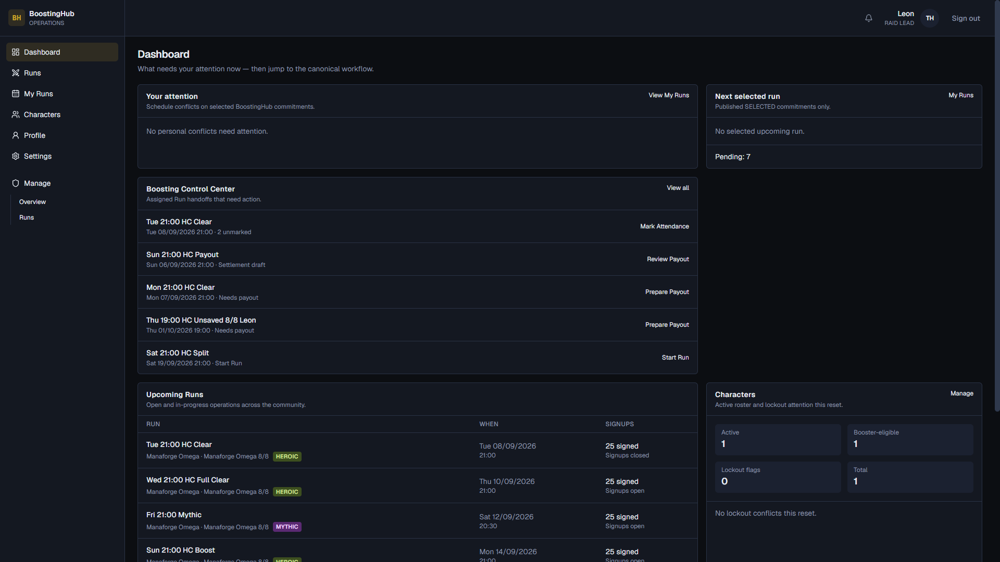
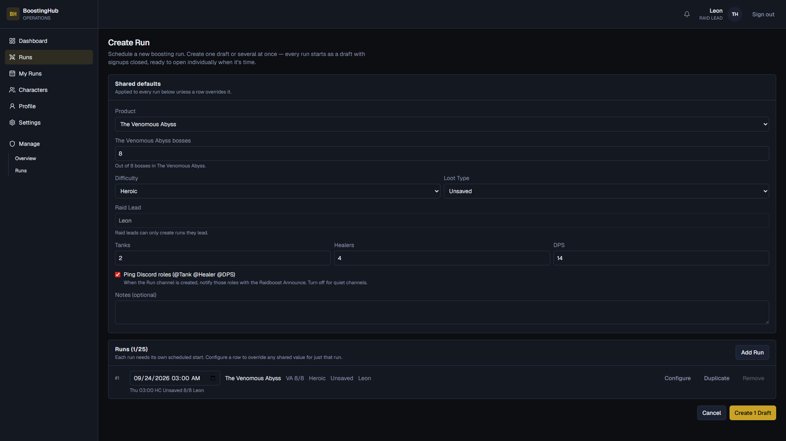
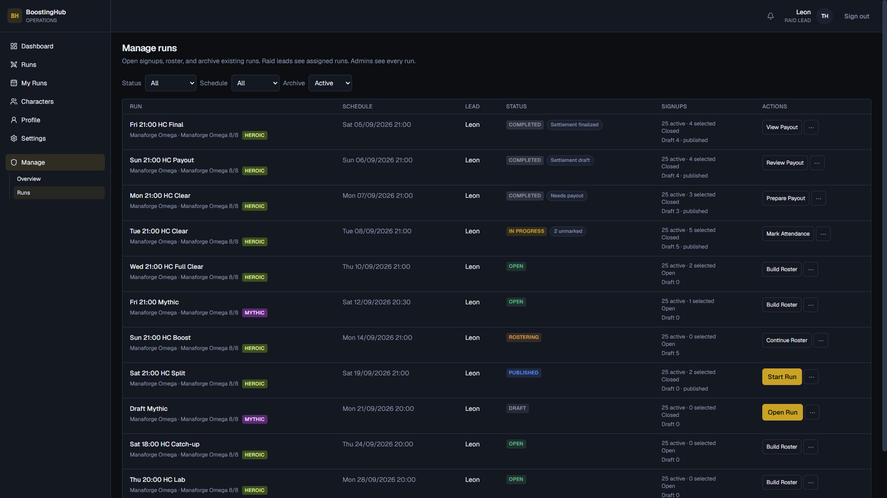
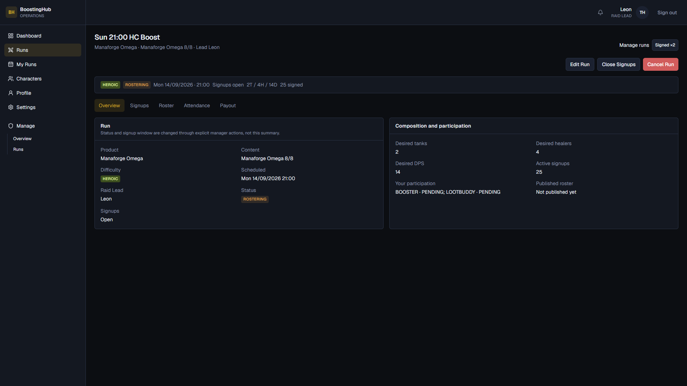
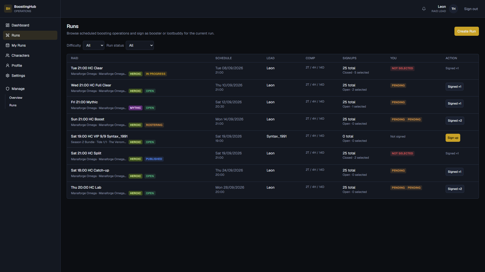
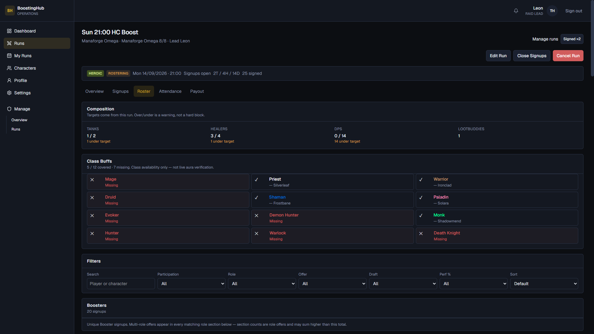
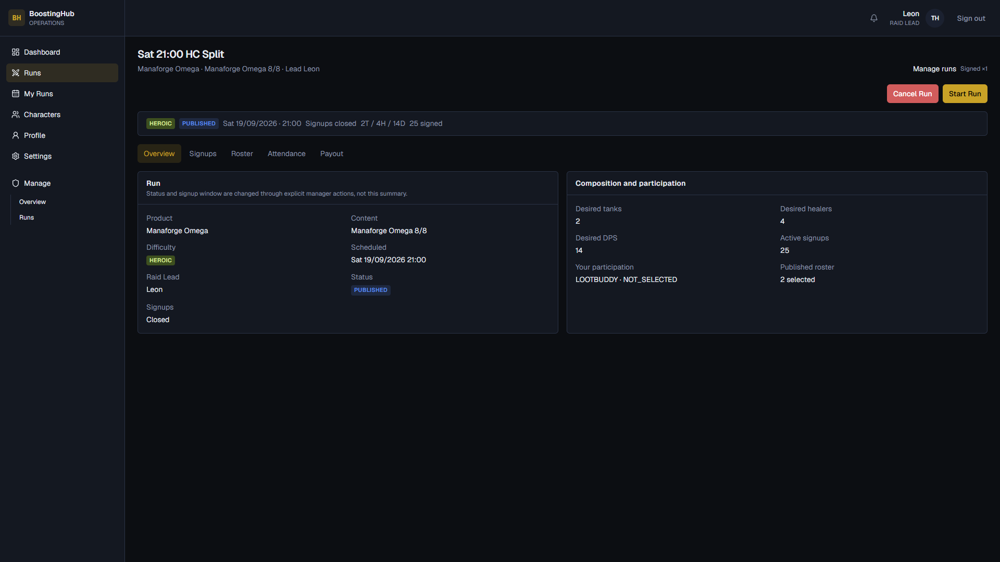
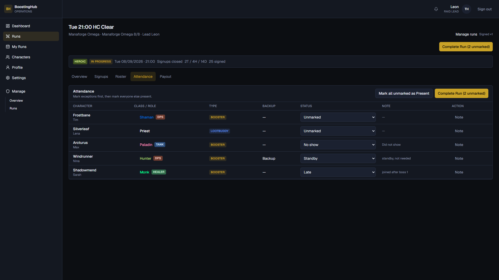

# Raid Lead Guide

A quick introduction to BoostingHub as a **RAID_LEAD**: create runs, open signups, build the roster, start the run, mark attendance and complete it.

> You only manage **your own** runs (lead = you). Admins can see and edit all runs.

---

## 1. Sign in

Like every user: **Continue with Discord**.


After signing in you see **RAID LEAD** in the top right and the **Manage** section in the sidebar.

---

## 2. Dashboard — Boosting Control Center

The **Boosting Control Center** lists hand-offs for the runs assigned to you, e.g.:

- **Build Roster** / **Start Run**
- **Mark Attendance**
- **Prepare Payout** / **Review Payout**



---

## 3. Create a run

1. Go to **Runs** → **Create Run** (or directly `/runs/create`).
2. Set the **Shared defaults**: product, bosses, difficulty, loot type, composition (tanks / healers / DPS), optional Discord role ping and notes.
3. Enter the **start time** for each row (1–25 runs at once).
4. **Create … Draft** — the run starts as a **DRAFT** with signups closed.



As a raid lead, the lead is fixed to you; you can't assign a different lead.

---

## 4. Manage runs

Under **Manage → Runs** you see your runs with status, signup window and actions (**Build Roster**, **View Run**, **Cancel Run**, …).



Public discovery happens under **Runs**; drafts do **not** show up there for regular users.

---

## 5. Open the run and control signups

On the run detail page (**Overview**):

| Action | Effect |
| --- | --- |
| **Open Run** | DRAFT → OPEN, opens signups |
| **Close Signups** / **Reopen Signups** | Closes / reopens the window (status stays OPEN/ROSTERING) |
| **Edit Run** | Change planning (restricted depending on status / signup history) |
| **Cancel Run** | Cancel; history is preserved |



Under **Runs** you see community runs and the **Create Run** button:



---

## 6. Build and publish the roster

**Roster** tab:

1. Keep an eye on the composition and **Class Buffs** (warnings, not hard blocks).
2. Select signup cards and set the **Selected Role** for boosters.
3. **Save Roster** saves the draft (first save on OPEN → status **ROSTERING**).
4. **Publish Roster** sets SELECTED / NOT_SELECTED and status **PUBLISHED**.

If there are composition warnings, you have to tick the acknowledge checkboxes before you can publish.



Notes:

- At most **one** selected **BOOSTER** per user; lootbuddies can be selected in addition.
- "Committed elsewhere" shows other BoostingHub commitments — schedule conflicts (< 2 h between start times) block the selection.

---

## 7. Start the run

On a **PUBLISHED** run: **Start Run**.



Afterwards: status **IN PROGRESS**, signups closed, attendance snapshot of the SELECTED participants. The roster is frozen.

---

## 8. Attendance and complete

**Attendance** tab:

1. Set the exceptions first (**Late**, **No show**, **Standby**, **Excused**, …) including a note.
2. **Mark all unmarked as Present**.
3. **Complete Run** — only possible once nobody is **Unmarked** anymore.



**Standby** is for backups who weren't needed — don't mark them as no-show.

---

## 9. Payout (short)

After **COMPLETED**, **Payout** tab:

1. Prepare the settlement draft (gold pot entered manually)
2. Calculate / finalize the split
3. An admin does **Mark Paid**

Details: [run-payouts.md](../features/run-payouts.md).

---

## Typical flow

```text
Create Draft
  → Edit (if needed)
  → Open Run (signups open)
  → Collect signups / close window
  → Save roster → Publish
  → Start Run
  → Attendance → Complete
  → Payout
```

---

## Quick checklist

1. Sign in with Discord as RAID_LEAD
2. **Create Run** → draft
3. **Open Run**, watch the signups
4. Save the **Roster** and **Publish**
5. **Start Run** → Attendance → **Complete**
6. Prepare the payout (an admin marks it paid)
