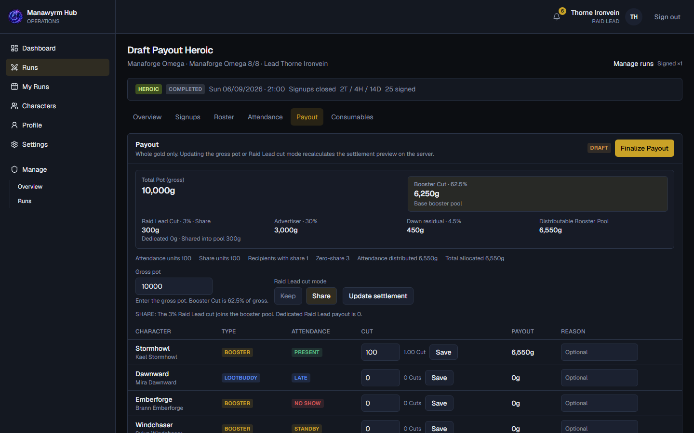

# Raid Lead Guide

Kurze Einführung in **Manawyrm Hub** als **RAID_LEAD**: Runs anlegen, Signups öffnen, Roster bauen, starten, Attendance markieren, Complete und Payout vorbereiten.

> Du verwaltest **deine** zugewiesenen Runs. **ADMIN** kann alle Runs verwalten.

App: https://manawyrm-boosting.com

Live-Discord-Guide (v2 Embeds): siehe [raidlead-discord-preview.md](./raidlead-discord-preview.md). Veröffentlichen mit `npm run guide:raidlead:publish` (kein Append-Only mehr).

---

## 1. Raid Lead Basics

Mit **Discord** anmelden. Du siehst **RAID LEAD** und **Manage**. Das **Dashboard** zeigt Hand-offs (Build Roster / Start / Attendance / Payout).

---

## 2. Run erstellen

**Runs → Create Run** (1–25 Drafts in einem Submit).

Shared Defaults: **Product**, **Bosses**, **Difficulty** (Normal / Heroic / Mythic), **Run type** (Saved / Unsaved / VIP / **Community**), Composition, optionaler Discord-Role-Ping + Notes. Startzeit pro Zeile → **Create N Draft(s)**.

Mythic kann nicht Saved nutzen. Als Raid Lead bist du immer der Lead.

---

## 3. Signups öffnen & verwalten

Auf **Overview**: **Open Run** · **Close / Reopen Signups** · **Edit Run** (bis Start) · **Cancel Run** (nicht nach Start).

Discord hält persistente **Signups**- und **Roster**-Messages. Drafts erscheinen nicht unter öffentlichen **Runs**.

---

## 4. Roster bauen

**Signup ≠ Selected.**

Offers prüfen → Character / **Selected Role** wählen → Lootbuddies / External Boosters → Composition & Class Buffs → Schedule-/Commitment-Warnungen → **Save Roster** → **Publish Roster** (SELECTED / NOT_SELECTED → Published).

---

## 5. Start & Attendance

**Start Run** → In Progress, Signups zu, Attendance-Snapshot, Discord-Operations-Output.

Attendance: Present / Late / No show / Standby / Excused · Mark all unmarked as Present · Complete braucht keine Unmarked-Zeilen.

---

## 6. Complete & Payout

**Complete** → **Payout**-Tab: Pot → Split → KEEP/SHARE → Finalize → Admin **Mark Paid**.

External Boosters stehen **nicht** auf dem Settlement. Nach Complete gibt es den Consumables-(WCL)-Audit.

Lifecycle: Draft → Open → Rostering → Published → In Progress → Completed → Paid

Discord: `/guide raidlead`
